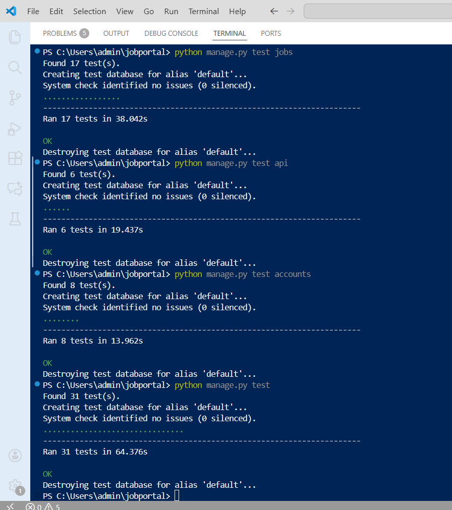
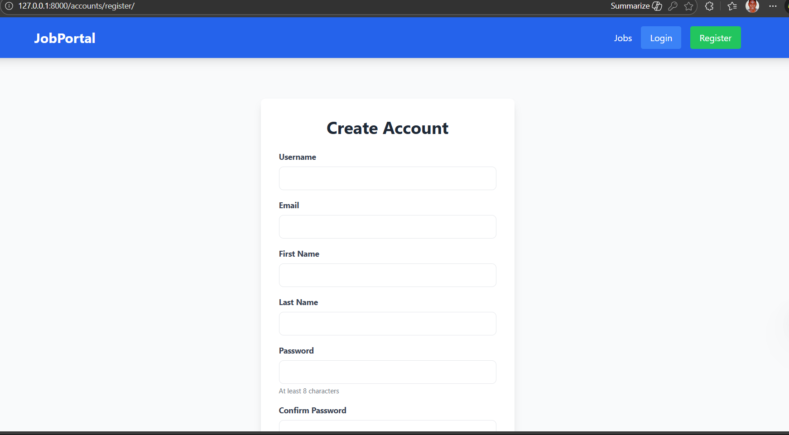
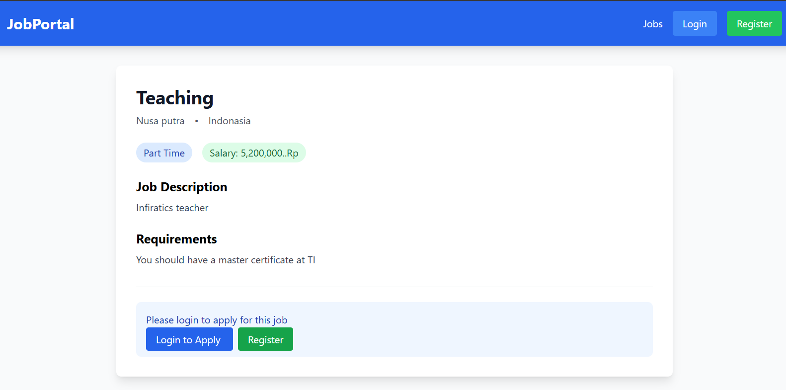
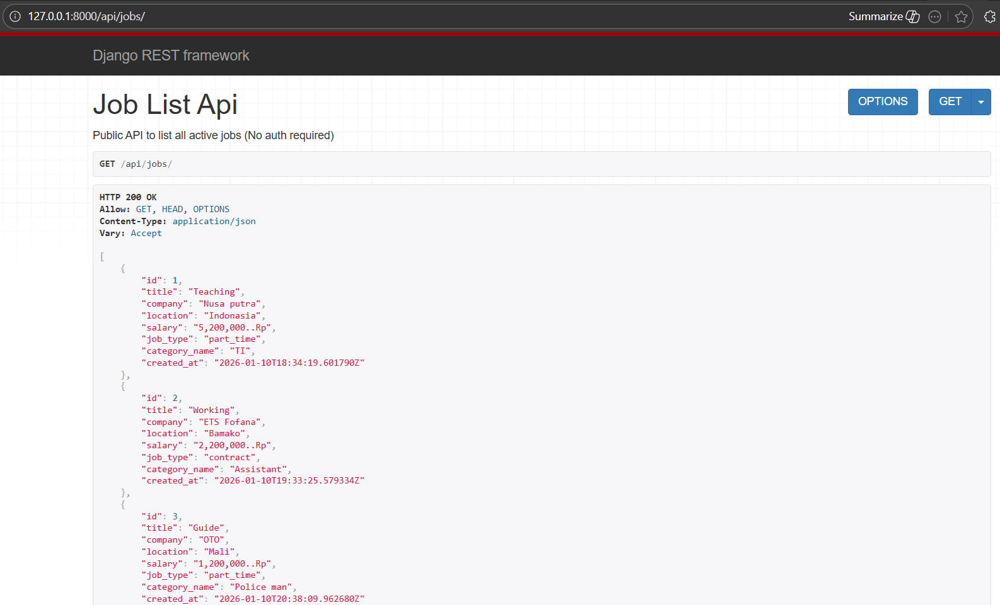
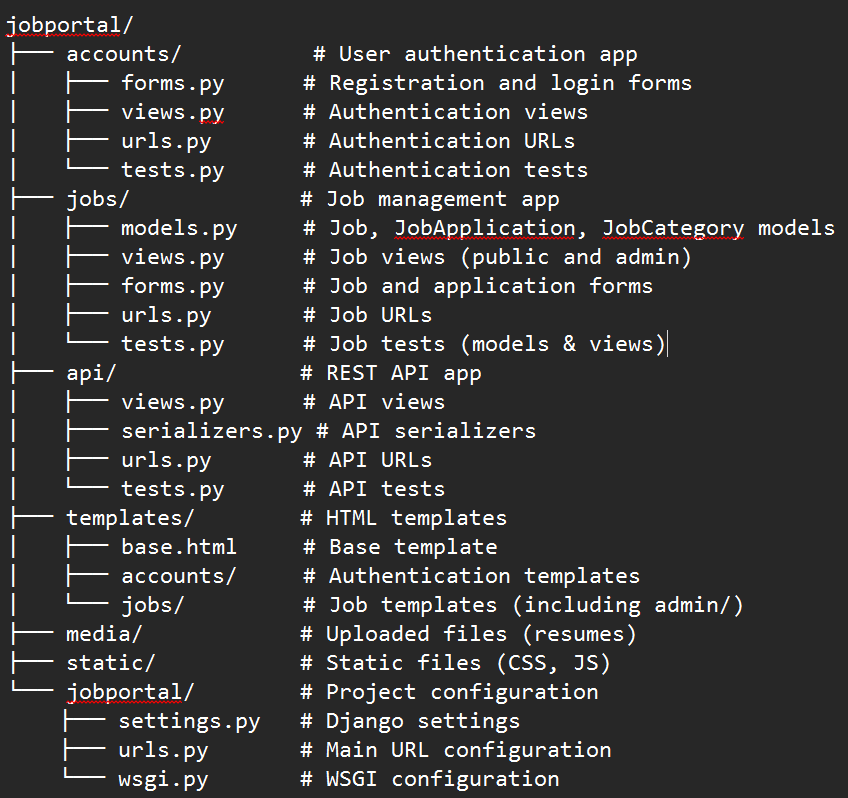

# 🚀 Job Portal - Django Application

A complete job portal with Django featuring JWT authentication, role-based access control (Admin/Member), and RESTful API.


# 🎥 Screen Recording link video:
https://youtu.be/JwcmV4YBiPI?si=e9HJp18rtua1HN8b


## 📸 Screenshots

### Test Result


### Home Page


### Login Page


### Registration Page  


### Job Details Page


### Admin Dashboard


### REST API


### 📁 Project Structure



## Features

- ✅ User Authentication (Login/Register)
- ✅ Two User Roles: Admin and Member
- ✅ Admin can post and manage jobs
- ✅ Members can apply for jobs
- ✅ Public job listings
- ✅ Protected API with JWT authentication
- ✅ File uploads for resumes
- ✅ Responsive design with Tailwind CSS 


## Test Coverage

[](https://github.com/Oumar2025/job-portal/actions/workflows/test.yml)
[](https://codecov.io/gh/Oumar2025/job-portal)


# Installation

## 1. Clone the repository:

git remote add origin https://github.com/Oumar2025/job-portal.git
cd job-portal


# Here are the requirements fulfilled on My project:

## ✅ FULFILLED REQUIREMENTS:
1. **Original Idea** ✅ - Not a tutorial clone
2. **Good UI/UX** ✅ - Uses Tailwind CSS, clear layout
3. **System works normally** ✅ - No crashes in testing
4. **No major bugs** ✅ - 31 tests passing
5. **Clean & readable code** ✅ - Well-structured Django code
6. **Modular architecture** ✅ - Separate apps (accounts, jobs, api)
7. **Middleware implementation** ✅ - Django middleware
8. **JWT Authentication** ✅ - Using djangorestframework-simplejwt
9. **Multiple user roles (RBAC)** ✅ - Admin and Member roles
10. **Protected & public routes** ✅ - Public job list, protected details/applications
11. **Protected API endpoints using JWT** ✅ - API requires JWT for details/apply
12. **Public API endpoints** ✅ - `/api/jobs/` is public
13. **Data validation** ✅ - Django forms & serializers
14. **Testing implemented** ✅ - 31 unit/integration tests

## ❌ NOT FULFILLED:
1. **Prisma for database management** ❌ - We're using Django ORM (can't change without rewriting)


# 📋 Additional Features

## 👥 User Management
- **Two User Roles**: Admin (post jobs, manage applications) and Member (apply for jobs)
- **Secure Authentication**: JWT token-based authentication for API
- **Registration & Login**: Custom forms with validation

## 💼 Job Management
- **Public Job Listings**: View jobs without registration
- **Job Applications**: Members can apply with resume and cover letter
- **Admin Dashboard**: Post and manage job listings

## 🔧 Technical Features
- **RESTful API**: Public and protected endpoints
- **JWT Authentication**: Secure API access
- **File Upload**: Resume upload functionality
- **Responsive Design**: Tailwind CSS for modern UI
- **Comprehensive Testing**: 31+ unit and integration tests

# 🏗️ Architecture


jobportal/
├── accounts/          # User authentication (login, register, profile)
├── jobs/             # Job listings and applications
├── api/              # REST API with JWT authentication
├── templates/        # HTML templates with Tailwind CSS
└── jobportal/        # Project configuration


## 🔐 Security & Authentication

- **JWT Tokens**: Secure API authentication
- **Role-Based Access**: Admin vs Member permissions
- **Protected Routes**: Authentication required for sensitive operations
- **CSRF Protection**: Django's built-in security
- **Password Hashing**: Secure user credentials

## 📡 API Endpoints

| Method | Endpoint | Description | Auth Required |
|--------|----------|-------------|---------------|
| GET | `/api/jobs/` | List all jobs | No |
| GET | `/api/jobs/{id}/` | Get job details | Yes (JWT) |
| POST | `/api/jobs/{id}/apply/` | Apply for job | Yes (JWT) |
| POST | `/api/token/` | Get JWT token | No |
| POST | `/api/token/refresh/` | Refresh token | Yes (JWT) |
| GET | `/api/my-applications/` | User's applications | Yes (JWT) |

# 🚀 Quick Start

## Prerequisites
- Python 3.8+
- pip

# Installation

## 1. Clone and setup
 
   git remote add origin https://github.com/Oumar2025/job-portal.git
   cd job-portal
   

## 2. Install dependencies
  
   pip install -r requirements.txt
   

## 3. Setup database
  
   python manage.py migrate
   python manage.py createsuperuser
   

## 4. Run server
   
   python manage.py runserver


## 5. Access at: 
   `http://127.0.0.1:8000/`

## 🧪 Testing

Run the complete test suite:
```bash
# All tests
python manage.py test

# Specific apps
python manage.py test accounts
python manage.py test jobs  
python manage.py test api
```

## 🛠️ Tech Stack

- **Backend**: Django 6.0, Django REST Framework
- **Authentication**: JWT (djangorestframework-simplejwt)
- **Database**: SQLite (dev), Django ORM
- **Frontend**: Django Templates, Tailwind CSS
- **File Handling**: Pillow

## 📁 Project Structure

The project follows Django's MTV (Model-Template-View) pattern with separate apps:

- **accounts/**: User authentication and profiles
- **jobs/**: Job listings, applications, and admin management
- **api/**: REST API with JWT authentication
- **templates/**: HTML templates with base layout

## ✅ Testing Coverage

- **31 Passing Tests**: Models, Views, and API endpoints
- **Unit Tests**: Individual component testing
- **Integration Tests**: End-to-end user flows
- **API Tests**: REST endpoint validation

## 🔒 Security Features Implemented

1. **JWT Authentication** for API endpoints
2. **Role-Based Access Control** (Admin/Member)
3. **CSRF Protection** on all forms
4. **Secure Password Storage** (Django hashing)
5. **Input Validation** on all forms and API endpoints
6. **File Type Validation** for resume uploads

## 🚀 Deployment Ready

The application is production-ready with:
- Environment-based configuration
- Secure default settings
- Database migrations
- Static file handling
- Error logging

## 📄 License

MIT License

## 👤 Author

Your Name - GitHub: [@Oumar2025](https://github.com/Oumar2025)

---

<div align="center">
  <p>Built with ❤️ using Django & Django REST Framework</p>
  <p>If you find this project useful, please give it a ⭐️!</p>
</div>
```
